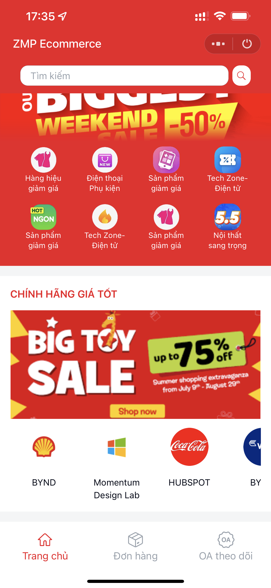

# ZMP Ecommerce

Starter template for building a restaurant's mini program. Main features:

-View the products available at each event, category, and store
—View product details
—Add and edit items in your shopping cart
-Purchase the items you want and enter your shipping address
-Managing the stores(OA) you are following

|                         Preview                         |               Open Zalo and scan this QR                |
| :-----------------------------------------------------: | :-----------------------------------------------------: |
|  |  |

## Pre-requisites

1. [Install Node JS](https://nodejs.org/en/download/)
1. [Install Mini App DevTools CLI](https://mini.zalo.me/docs/dev-tools)
1. Download or clone this repository

## Setup

1. Install dependencies

   ```bash
   npm install
   ```

1. Start dev server using `zmp-cli`

   ```bash
   zmp start
   ```

1. Open `localhost:3000` on your browser and start coding 🔥

## Deployment

1. Create a mini program. For instruction on how to create a mini program, please refer to [Coffee Shop Tutorial](https://mini.zalo.me/docs/tutorial/step-1/#1-tạo-một-ứng-dụng-zalo-mini-program-mới-trên-trang-chủ-của-zalo-mini-program)

1. Setup payment methods if you want to accept online payments
   

1. Deploy your mini program to Zalo using the mini app ID created in step 1.

   ```bash
   zmp login
   zmp deploy
   ```

1. Open Zalo and scan the QR code to preview your mini program

## Usage:

The repository contains sample UI components for building your application. You might wish to integrate internal APIs to fetch products, cart, stores, address... or modify the code to suit your business needs.

Folder structure:

- **`src`**: Contain all logic source code of your Mini App. Inside `src` folder:

  - **`components`**: reusable components written in React.JS
  - **`css`**: Stylesheets, pre-processors also supported
  - **`pages`**: a Page is also a component but will act as an entire view and must be registered inside `app-config.json` (https://mini.zalo.me/docs/framework/getting-started/app-config/#pages). Sheets (such as `mini-store.tsx`, `my-order.tsx`) are also pages, to handle the native back button on Android behavior. They won't be registered inside `app-config.json` but in the `View` component's `routesAdd` property.
  - **`services`**: reusable logic for complex tasks that should be separated from your component, such as fetching API, getting location from Zalo or caching stuff,...
  - **`utils`**: reusable utility functions, such as math function, get image url, etc,...
  - **`dummy`**: create dummy data for this template such as stores and products data,...
  - **`app.ts`**: entry point of your Mini App
  - **`hooks.ts`**: reusable custom hooks
  - **`model.ts`**: contain TypeScript type and interface declarations
  - **`modules.d.ts`**: contain TypeScript declarations for third party modules
  - **`store.ts`**: centralized state management (https://mini.zalo.me/docs/framework/getting-started/store/)

- **`app-config.json`**: Global configuration for your Mini App (https://mini.zalo.me/docs/framework/getting-started/app-config)

The other files (such as `tailwind.config.js`, `vite.config.ts`, `tsconfig.json`, `postcss.config.js`) are configurations for libraries used in your application. Visit the library's documentation to learn how to use them.

## Recipes

### Changing Header bar

Just change the `app.title` and `app/statusBarColor` property in `app-config.json` to set default name and default primary color of app:

```json
{
  "app": {
    "title": "ZMP Ecommerce",
    "statusBarColor": "#EF1724"
  }
}
```

Because the default navigation bar does not support custom a ReactNode title, we must use a custom header. And we could change header props (such as title, leftIcon, type, etc...) reactively on each page using services `setHeader` in `services/header`.

Besides that, we can change the color of the status bar on devices using the utility function `changeStatusBarColor`.

```tsx
setHeader({
  customTitle: searchBar,
  type: 'secondary',
});
changeStatusBarColor('secondary');
```

In the 'Changing color theme' category, you can see a custom header with a search bar.

### Changing your's logo

Visit [Zalo Mini Program](https://mini.zalo.me/) and go to your mini program's settings to change the logo.

### Changing color theme

You can change the primary color theme by setting the variable in `src/css/app.scss`:

```scss
:root {
  --zmp-theme-color: #ef1724;
}
```

| Default                                                                        | Green                                                                      | Blue                                                                     |
| ------------------------------------------------------------------------------ | -------------------------------------------------------------------------- | ------------------------------------------------------------------------ |
|  |  |  |

The theme color will affect most of the application components. To make a deeper color change, override the other colors in `src/css/app.scss`. For the list of available colors, please visit [Color Theme](https://mini.zalo.me/docs/framework/components/color-themes/).

## License

Copyright (c) Zalo Group. and its affiliates. All rights reserved.

The examples provided by Zalo Group are for non-commercial testing and evaluation
purposes only. Zalo Group reserves all rights not expressly granted.
