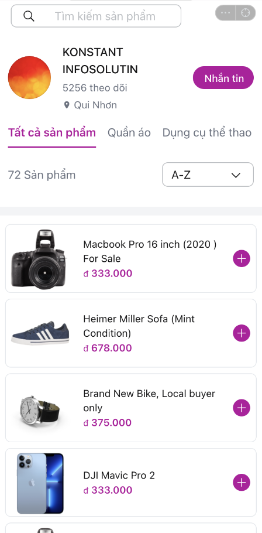

# ZaUI Shop

<p style="display: flex; flex-wrap: wrap; gap: 4px">
  
  
  
  
  
  
</p>

Starter template for building a shop's mini app. Main features:

- View the products available at each category, and store
- View product details
- Add and edit items in your shopping cart
- Purchase the items you want and enter your shipping address

|                                Preview                                |                                     Open Zalo and scan this QR                                      |
| :-------------------------------------------------------------------: | :-------------------------------------------------------------------------------------------------: |
|  |  |

## Pre-requisites

1. [Install Node JS](https://nodejs.org/en/download/)
1. [Install Mini App DevTools CLI](https://mini.zalo.me/docs/dev-tools)
1. Download or clone this repository

## Setup

1. Install dependencies

   ```bash
   npm install
   ```

1. Start dev server using [zmp-cli](https://mini.zalo.me/docs/dev-tools/)

   ```bash
   zmp start
   ```

1. Open `localhost:3000` on your browser and start coding 🔥

## Deployment

1. Create a mini app. For instruction on how to create a mini app, please refer to [Coffee Shop Tutorial](https://mini.zalo.me/docs/tutorial/step-1/#1-tạo-một-ứng-dụng-zalo-mini-program-mới-trên-trang-chủ-của-zalo-mini-program). (If you use this source code for development and deployment, you can skip from `zmp init` to the end.)

1. Setup payment methods if you want to accept online payments
   

1. Deploy your mini app to Zalo using the mini app ID created in step 1.

   ```bash
   zmp login
   zmp deploy
   ```

1. Open Zalo and scan the QR code to preview your mini app

## Usage:

The repository contains sample UI components for building your own application. You might wish to integrate internal APIs to fetch products, cart, stores and addresses or modify the code to suit your business needs.

Folder structure:

- **`src`**: Contain all logic source code of your Mini App. Inside `src` folder:

  - **`components`**: reusable components written in React.JS
  - **`css`**: Stylesheets, pre-processors also supported
  - **`pages`**: a Page is also a component but will act as an entire view and must be registered inside `app.tsx` (https://mini.zalo.me/docs/zaui/components/router/ZMPRouter/).
  - **`services`**: reusable logic for complex tasks that should be separated from your component, such as fetching API, getting location from Zalo or caching stuff,...
  - **`utils`**: reusable utility functions, such as math function, get image url, etc,...
  - **`dummy`**: create dummy data for this template such as stores and products data,...
  - **`app.ts`**: entry point of your Mini App
  - **`hooks.ts`**: building your own Hooks lets you extract component logic into reusable functions, such as adding product to cart, resetting product picked.
  - **`model.ts`**: contain TypeScript type and interface declarations
  - **`modules.d.ts`**: contain TypeScript declarations for third party modules
  - **`state.ts`**: centralized state management (https://recoiljs.org/docs/introduction/installation)

- **`app-config.json`**: Global configuration for your Mini App (https://mini.zalo.me/docs/framework/getting-started/app-config)

The other files (such as `tailwind.config.js`, `vite.config.ts`, `tsconfig.json`, `postcss.config.js`) are configurations for libraries used in your application. Visit the library's documentation to learn how to use them.

## Recipes

### Loading products

The template comes with dummy products inside, you can update `src/state.ts` to modify how your products load:


You can use `fetch` to load products from your Server API and map the response to match the template's `Product` interface like below. Notice the `async` keyword:

```ts
export const storeState = selector<Store>({
  key: "store",
  get: async () => {
    const response = await fetch("https://dummyjson.com/products");
    const data = await response.json();
    return {
      id: 1,
      nameStore: "🧸 Store",
      address: "Quận 7, TP. Hồ Chí Minh",
      logoStore:
        "https://cdn.shopify.com/s/files/1/0452/9497/7192/products/3f52d36b79ac2ef9c55a84ed4c043dac.jpg",
      bannerStore:
        "https://cdn.shopify.com/s/files/1/0452/9497/7192/products/3f52d36b79ac2ef9c55a84ed4c043dac.jpg",
      categories: ["Áo thun", "Quần jean"],
      followers: 9999,
      type: "personal",
      listProducts: data.products.map((product) => ({
        id: product.id,
        nameProduct: product.title,
        description: product.description,
        options: [],
        imgProduct: product.images[0],
        retailPrice: product.price,
        salePrice: (product.price * (100 - product.discountPercentage)) / 100,
      })),
    };
  },
});
```


### Changing Header bar

Just change the `app.title` and `app/statusBarColor` property in `app-config.json` to set default name and default primary color of app:

```json
{
  "app": {
    "title": "ZaUI Shop",
    "statusBarColor": "#EF1724"
  }
}
```

Because the default navigation bar does not support custom a ReactNode title, we must use a custom header. And we could change header props (such as title, leftIcon, type, etc...) reactively on each page using a custom hook named `useSetHeader` in `hooks/useSetHeader`.

Moreover, we can change the color of the status bar on devices by using the SDK API `changeStatusBarColor`.

```tsx
setHeader({
  customTitle: searchBar,
  type: "secondary",
});
changeStatusBarColor("secondary");
```

In the 'Changing color theme' category, you can see a custom header with a search bar.

### Changing your's logo

Visit [Zalo Mini App](https://mini.zalo.me/) and go to your mini app's settings to change the logo.

### Changing color theme

- Using Zalo Mini App Studio
  - At the top left of the IDE, click the Configuration button. Then, at "Primary Color," you can select a primary color theme.
    > You can also set other fields here)
- Not using Zalo Mini App Studio

  - Solution 1:

    - Set all template fields (including the primary color theme field) in `app-config.json`(see more details for template fields in `zmp-config.json`):
      ```json
      {
        "template": {
          "primaryColor": "#625ff7",
          "searchBar": false,
          "shippingFee": "500000",
          "oaIDtoOpenChat": "4318657068771012646"
        }
      }
      ```

  - Solution 2:

    - Set the primary color theme by setting the variable in `src/css/app.scss`:

      ```scss
      :root {
        --zmp-primary-color: #ef1724;
        --zmp-primary-color-rgb: 239, 23, 36;
      }
      ```

    - Set the default color of the header bar in `app-config.json`:

      ```json
      {
        "app": {
          "statusBarColor": "#EF1724"
        }
      }
      ```

| Default                                                                     | Green                                                                      | Blue                                                                     |
| --------------------------------------------------------------------------- | -------------------------------------------------------------------------- | ------------------------------------------------------------------------ |
|  |  |  |

## License

Copyright (c) Zalo Group. and its affiliates. All rights reserved.

The examples provided by Zalo Group are for non-commercial testing and evaluation
purposes only. Zalo Group reserves all rights not expressly granted.
